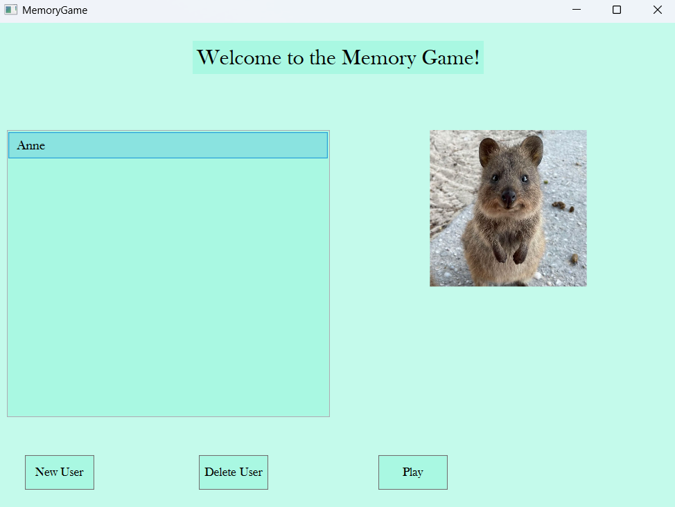
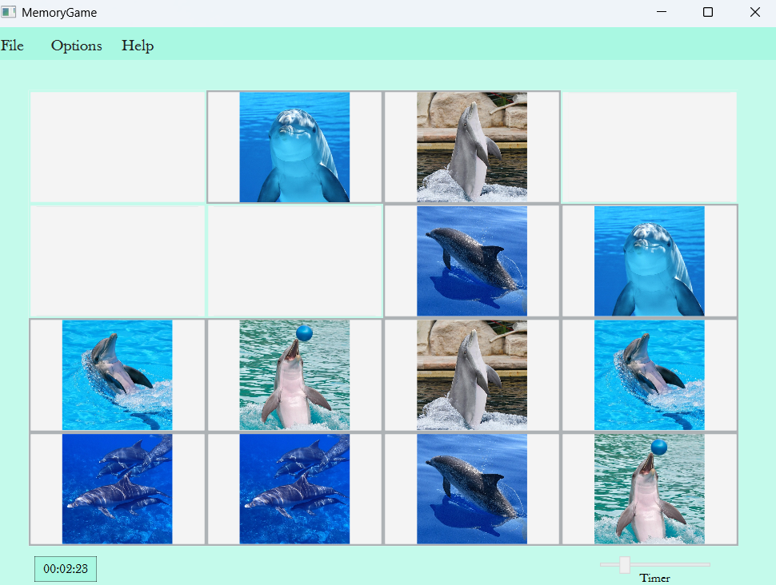

# 🧠 Memory Game (WPF + MVVM)

A memory game built in **WPF** using the **MVVM architectural pattern**, designed for modularity and scalability. The game allows users to sign in, select a profile image and name, and track their statistics. It features various game modes, themes, and game state persistence through JSON serialization.

---

## ✨ Features

### 🔐 Authentication
- **Sign In** and **Sign Up** using dedicated `UserControls`
- Store and display custom **user profile** (name + profile image)
- Navigate back to the login screen at any time

### 🎯 Game Setup
- Choose **matrix size** to define difficulty
- Select image category (Animals - 3 categories)
- Set a **custom timer**
- Fully integrated with MVVM via **RelayCommands** and **DataBinding**

### 🧩 Gameplay
- Interactive and responsive UI with flip card logic
- Timer and moves tracked during gameplay
- Pause, resume, and restart options

### 💾 Save & Load
- Save the game state (including timer, moves, player, board) as JSON
- Load the **last saved game** from the menu

### 📊 Statistics
- Track each player’s stats:
  - Games Played
  - Games Won
- Statistics displayed in a dedicated `UserControl` view

---

## ⚙️ Technologies Used

- **WPF (.NET)** for UI and interaction
- **MVVM** pattern for clean separation of logic
- **RelayCommand** for ICommand implementations
- **UserControls** for modular UI components:
  - SignInControl
  - SignUpControl
  - GameControl
- **JSON for game state serializations

  
  

